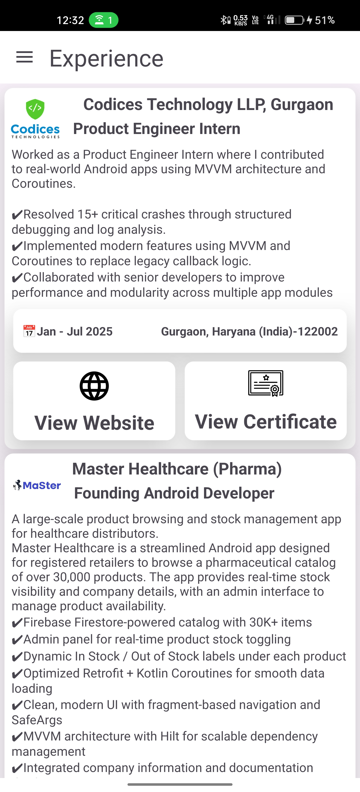
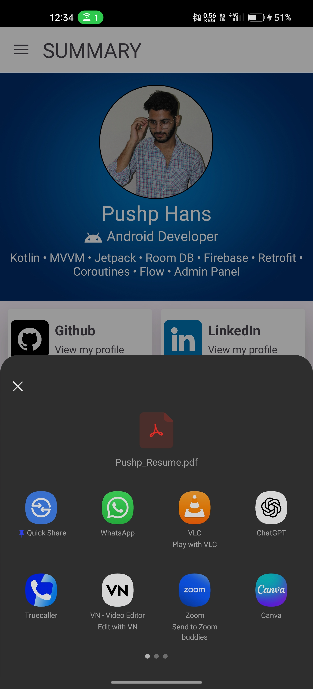

# 📱 Android Developer Portfolio App

Welcome to my **Android Portfolio App**, crafted with ❤️ using **Kotlin + MVVM + Jetpack Navigation**.

This app is a sleek and interactive way to showcase my skills, experience, and academic journey — all inside one intuitive interface. Ideal for recruiters and clients to get a quick overview of who I am.


## 🚀 Features

- 🏠 **Home** – Summary screen with key links (GitHub, LinkedIn, Resume)
- 📂 **Navigation Drawer** – Slide to switch between fragments
- 💼 **Experience** – Work history, internships, and roles
- 🎓 **Education** – Academic background
- 📞 **Contact Me** – Quick call or email with single tap
- 📄 **Resume Share** – Share my resume as PDF directly
- 🔗 **GitHub + LinkedIn Integration** – Open in browser via intents


## 📸 Screenshots
### 🔸 Splash Screen
 

<br>

### 🔸 Home Screen 


<br>

### 🔸 Navigation Drawer


<br>

### 🔸 Experience Screen


<br>

### 🔸 Contact Me Screen


<br>

### 🔸 Sharing
 

<br>


## 🛠️ Tech Stack

- **Language:** Kotlin
- **Architecture:** MVVM
- **Navigation:** Jetpack Navigation Component
- **UI:** Material Design 3, CardViews, ConstraintLayout
- **Resume Sharing:** `Intent.ACTION_SEND` + `FileProvider`
- **Others:** `ActivityResultLauncher`, `Intent.ACTION_VIEW`, `DrawerLayout`, `Handler`


## 📎 Resume Integration

- Resume is placed in `res/raw/myresume.pdf`
  - Shared via:

      ```kotlin  
      val intent = Intent(Intent.ACTION_SEND).apply {
          type = "application/pdf"
          putExtra(Intent.EXTRA_STREAM, uri)
      }

> FileProvider used with correct path config

## 🔗 Connect With Me
1. 📧 Email: pushp.hans1502@gmail.com

2. 💻 GitHub: github.com/pushphans

3. 💼 LinkedIn: linkedin.com/in/pushphans1502/
